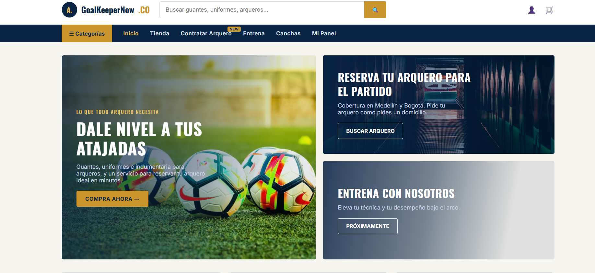
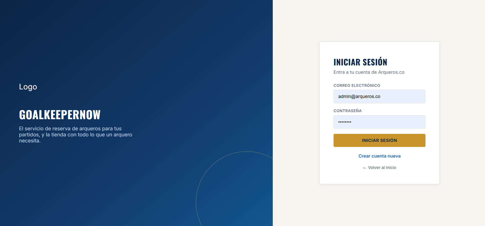
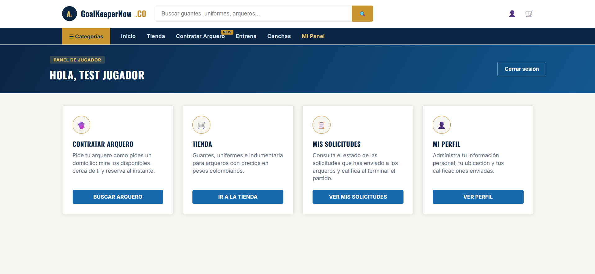
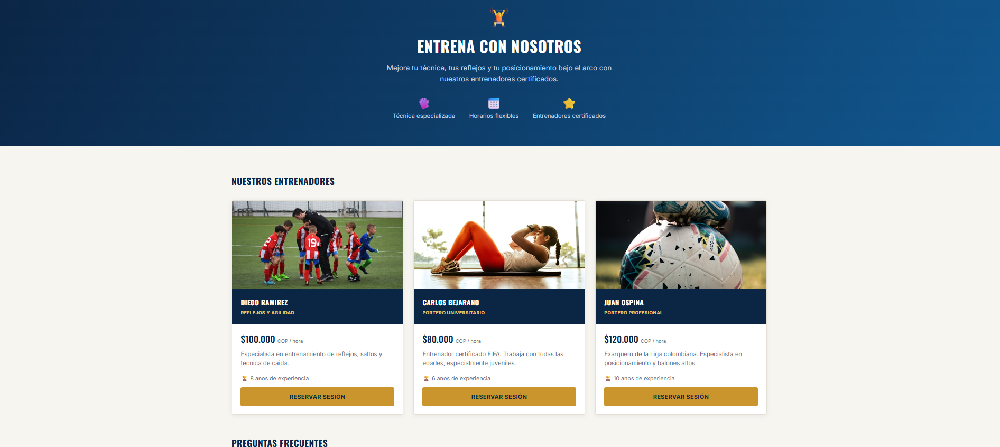
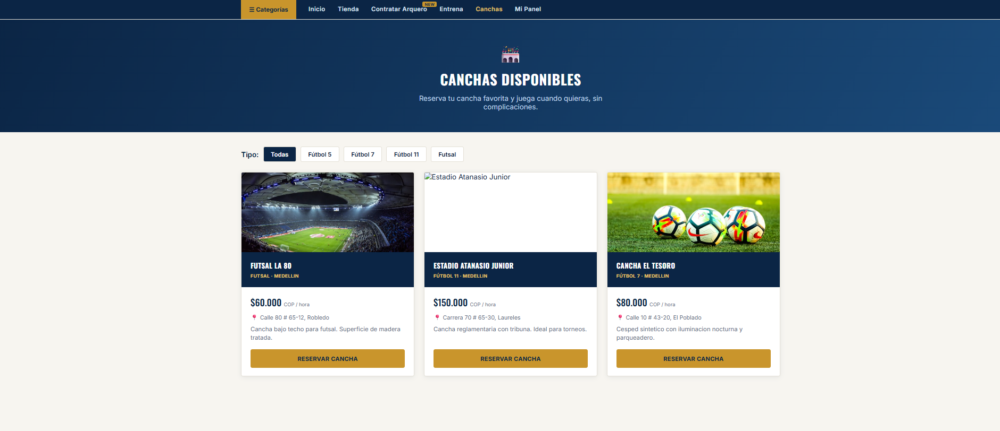
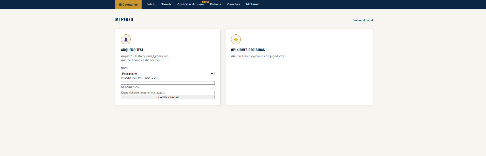
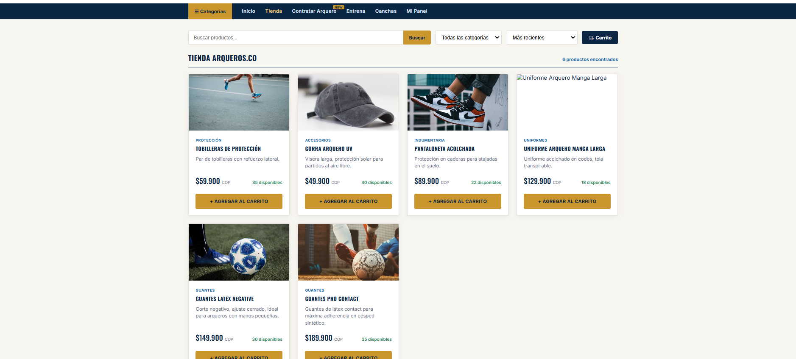
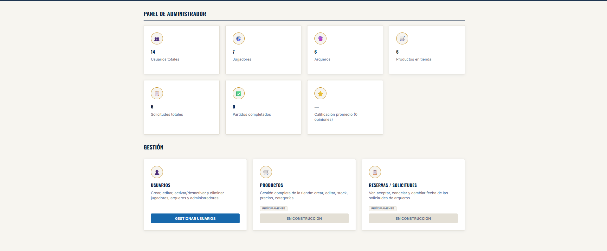

# 🧤 GoalKeeperNow

GoalKeeperNow es una aplicación web desarrollada como proyecto del SENA para facilitar la conexión entre jugadores, porteros, entrenadores y escenarios deportivos. La plataforma permite gestionar entrenamientos, solicitudes, reservas de canchas y una tienda deportiva desde una sola aplicación.

---

# 🚀 Tecnologías utilizadas

### Frontend
- React
- Vite
- CSS

### Backend
- Node.js
- Express.js

### Base de datos
- MySQL
- phpMyAdmin

### Otras tecnologías
- JWT (Autenticación)
- bcryptjs
- REST API

---

# ✨ Funcionalidades

- 🔐 Registro e inicio de sesión
- 👤 Gestión de usuarios
- 🧤 Perfil de porteros
- 🧑‍🏫 Gestión de entrenadores
- 🏟️ Reserva de canchas
- 📅 Disponibilidad de entrenadores
- 📋 Solicitudes entre jugadores y porteros
- ⭐ Sistema de calificaciones
- 🛒 Tienda deportiva
- ⚙️ Panel de administración

---

# 📂 Estructura del proyecto

```
Arqueros
│
├── backend
├── goalkeepernow-react
├── basededatos
│   └── base_completa_goalkeepernow.sql
├── imagenes
├── README.md
└── .gitignore
```

---

# ⚙️ Instalación

## 1️⃣ Clonar el repositorio

```bash
git clone (https://github.com/TeoCalle/GoalKeeperNow)
```

---

## 2️⃣ Backend

```bash
cd backend
npm install
npm start
```

---

## 3️⃣ Frontend

```bash
cd goalkeepernow-react
npm install
npm run dev
```

---

## 4️⃣ Base de datos

1. Abrir phpMyAdmin.
2. Crear una base de datos llamada:

```
goalkeepernow
```

3. Importar el archivo:

```
basededatos/base_completa_goalkeepernow.sql
```

---

# 📸 Capturas del sistema

## Página principal



---

## Inicio de sesión



---

## Dashboard



---

## Gestión de entrenadores



---

## Gestión de canchas



---

## Perfil del portero



---

## Solicitudes del jugador


---

## Solicitudes del arquero


---

## Tienda deportiva



---

## Panel de administración



---

# 👨‍💻 Autor

**Mateo Calle Bolívar**
**Tomas Peréz Marín**

Tecnólogo en Análisis y Desarrollo de Software (SENA)

---

